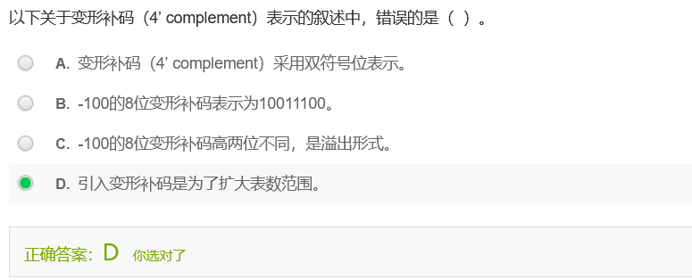
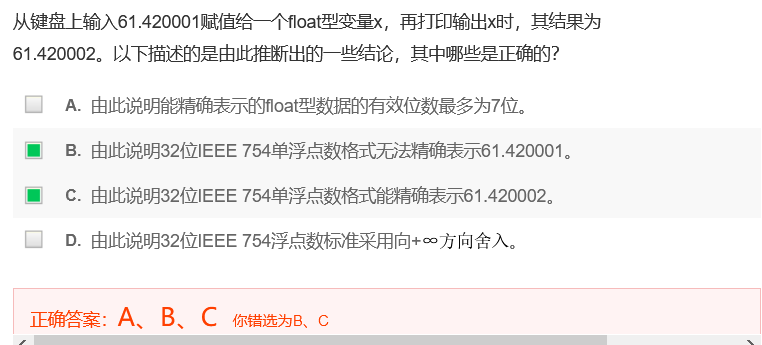
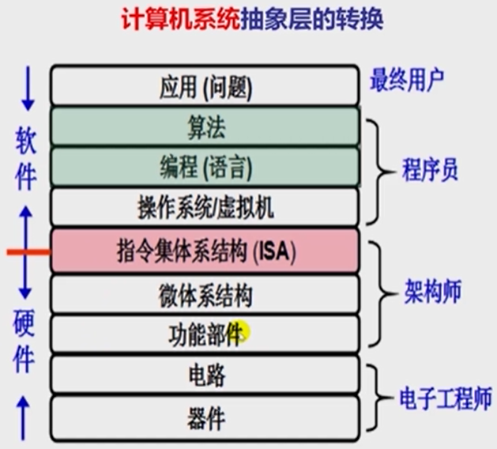
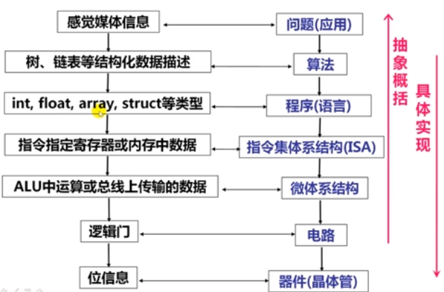
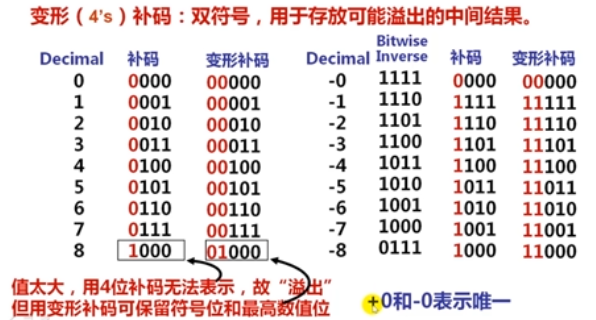
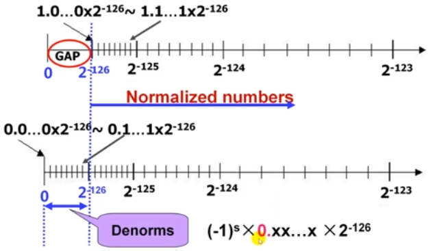

# 【考研黑书向】深入理解计算机系统CSAPP

## 【写在前面】

### 问题

- [x] [机器数、原码、反码、补码等等xx码的区别、联系和计算](#定点数的编码-机器数原码反码补码等等xx码的区别以及联系)
- [x] [算术右移和逻辑右移](#算术左右移和逻辑左右移)
- [ ] 信息表示和处理 位、整数 巧用无符号数：向下计数，看不懂 
- [ ] 信息表示和处理 位、整数 大小端举例，0xfffffea0的值的计算
- [ ] [定点数和浮点数的概念](#1x00-数制)
- [ ] 五段式指令流水线

### 参考

- [计算机系统基础(一)：程序的表示、转换与链接 袁春风](https://www.icourse163.org/course/NJU-1001625001)

  - 第一周 计算机系统概述

    - 计算机层次结构

  - 第二周 数据的表示和存储

    - 数制和编码
- 定点数的编码表示
- CSAPP课本

---

### 网课问题


- 考察将原来的4位表示扩充为8位表示
  - 法1：先将原来的4位扩充为8位的原码表示为：10001000，然后再将原码转换为补码-取反加一得：11111000
  - 法2：直接按符号位(该题中符号位为1)扩充左边的其余4位，得：11111000





## Part Zero 计算机系统的基本概念

### 1.计算机系统的层次结构

#### 计算机系统抽象层的转换



- 整个计算机系统分为**软件系统**和**硬件系统**
- **功能转换**：上层是下层的**抽象**，下层是上层的**实现**，**底层为上层提供支撑环境**
- 交界处为指令集体系结构ISA，实际上是作为软硬件交互的接口，即对硬件的抽象，这种抽象提供的功能为软件所用
    - ISA是计算机组成的抽象
    - ISA具体介绍
- 程序执行的结果取决于：
    - 算法、程序的编写
    - 语言处理系统
    - 操作系统
    - ISA
    - 微体系结构
    - 以及其他底层的东西等
- 重点在高级语言以下各抽象层
    - C语言程序设计层
        - 数据的机器级表示、运算
        - 语句和过程调用的机器级表示
    - 操作系统、编译和链接的部分内容
    - 指令集体系结构(ISA)和汇编层 :star:
        - 指令系统、机器代码、汇编语言
    - 微体系结构及硬件层
        - CPU的通用结构
        - 层次结构存储系统

---

#### 计算机系统层次

语言发展不断“抽象”，创造出不同的计算机系统的层次

|                             最早                             |                             发展                             |                             现代                             |
| :----------------------------------------------------------: | :----------------------------------------------------------: | :----------------------------------------------------------: |
|                   计算机用**机器语言**编程                   |                  计算机使用**汇编语言**编程                  |                 现代计算机用**高级语言**编程                 |
| 机器语言：第一代程序设计语言(First generation programming language, 1GL)，即用0和1编写程序 | 汇编语言：第二代程序设计语言(Second generation programming language, 2GL)，是一种**符号表示** | 1. 第三代程序设计语言(3GL)为过程式语言，编码时需要描述实现过程(“如何做”)；2. 第四代程序设计语言(4GL)为非过程式语言，编码时只需说明“做什么”，不需要描述具体的算法实现过程 |
| 用机器语言0和1编写的程序可以 直接运行在机器上，指令集体系结构是将计算机的硬件抽象成指令集，每条指令对应应用程序中的指令，通过这些指令我们可以使用计算机硬件 | 我们用汇编语言编写的程序必须由**汇编程序**转换为机器指令，才能在机器上执行执行；用汇编语言来编写程序，必须要有和机器交互的界面，由**操作系统**提供和封装 | 高级语言必须转换成机器指令构成的机器语言才能在计算机上执行，转化功能由语言系统中的**语言处理系统**完成；语言处理系统包括：各种语言处理程序(编译、汇编、链接)和运行时系统(库函数、调试、优化等)；操作系统包括人机交互界面和提供服务功能的内核例程 |
|      |       |       |

---

#### 计算机系统的不同用户

### 2.程序生成与运行的基本原理与工作过程

### 3.计算机系统的分析评价方法

## Part One 程序结构和执行

### 1.信息的表示和处理

#### a. 信息的编码与存储

##### a-1 数制

1. “转换”的概念在数据表示中的反映

  

2. 机器级数据
    - 数值数据
      - 整数(定点数，定点运算指令) - 无符号整数、有符号整数
      - 实数(浮点数，浮点运算指令) - 浮点数
      - 表示的三要素：
        - 进位计数制
        - 定/浮点表示(解决小数点问题)
    - 定点数的编码(解决正负号问题) - 如何用二进制编码：原码、补码、移码、反码(很少用)
    - 非数值数据
      - 逻辑数，包括位串
      - 西文字符和汉字
    
3. 数值数据中的小数点的表示
    - 约定小数点的位置
      - 定点数Fixed Point Number：小数点位置约定在固定位置的数
        - 形式过于僵硬，决定了固定位数的整数和小数部分，不利于同时表达特别大的数或者特别小的数
      - 浮点数Floating Point Number：小数点位置约定为可浮动的数
        - 是一种**数字表示方式**，类似于科学计数法
        - 定点小数用来表示浮点数的尾数部分
        - 定点整数用来表示(带符号/无符号)整数
        - **在计算机内部，任何实数都可以用两个定点数(定点小数-指定有效数字+定点整数-指定小数点的位置)来表示**

4. 二进制
    - MSB / LSB
    - 用二进制编码的原因
      - 物理器件
      - 编码、计数、运算规则简单
      - 逻辑运算
5. 十六进制
    - 引入八进制和十六进制的原因：(1)是二进制的简便表示，便于阅读和书写，显示时可缩短长度；(2)他们之间对应简单，转换容易
6. 进制转换
    - 10进制转k进制 (先将十进制数转化为二进制数，再将二进制转化为16或8进制)
      - 整数：除法-除基取余法，上右下左(最上面的余数位于右边/低位，最下面的余数位于左边/高位)
      - 小数：乘法-乘基取整法，上左下右
        - 现实中的精确值可能无法用0和1值表示
      - :star:常识需谨记
        - 整数部分的转换：1、2、4、8、16、32、64、128、256、512、1024、2048、4096、8192、16384、32768、65536
        - 小数部分的转换：0.5、0.25、0.125、0.0625 
    - k进制转10进制
      - 按权展开

##### a-3 【非数值数据】非数值数据的编码表示

1. 逻辑数据的编码表示
2. 西文字符的编码表示
   - 常用编码为7位ASCII码
   - 数字、字母、空格、回车、换行
3. 汉字及国际字符的编码表示
   - 编码形式
     - 输入码
     - 内码
     - 字模点阵或轮廓描述
   - GB2312-80字符集
4. 多媒体信息的表示
   - 多媒体信息用一个复杂的数据结构来描述，其中的基本数据或者是数值数据，或者是用0/1编码的非数值数据

##### a-4 数据宽度和存储容量的单位

###### 位以及位级运算

数据的基本宽度

1. 位 / 比特bit
2. 字节
3. 布尔代数
4. C语言中的

   - 位级运算
   - 异或
   - 逻辑运算
   - 移位计算

##### a-5 数据存储时的字节排列

#### b. 【数值数据】整数的表示与编码

##### b-1 定点数的编码-机器数、原码、反码、补码、移码的区别以及联系

**机器数**:star2:

  > 1. 概念：用0和1编码的计算机内部的0/1序列
  > 2. :star:真值：真正的值，即现实中带正负号的数
  > 3. 数在计算机中的表示形式 / 机器能识别的形式
  > 4. **带符号**：最高位0表示非负数，1表示负数
  > 5. 例子：假设机器字长为8位，则1表示为[00000001]，-1表示为[10000001]，其中00000001和10000001是机器数

**原码 Sign and Magnitude**

  > 1. 就是机器数
  > 2. 符号(最高位)+绝对值
  >
  > 整数采用**补码**表示，浮点数的尾数用**原码定点小数**表示

**反码**

  > 1. 表示
  >
  >    - 正数的反码是其本身
  >    - 负数的反码是符号位不变，其他位取反
  > 
  > 2. 例子
  >
  >    假设机器字长为8位，则[+1]=[00000001]原=[00000001]反；[-1]=[10000001]原=[11111110]反

**补码**

  > 模运算 [X]补 = 2^n +X ( -2^n ≤ X ＜ 2^n, mod 2^n)
  >
  > 1. 表示
  >
  >    - 正数的补码是其本身
  >    - 负数的补码在反码的基础上+1 
  >      - 负数的补码 = 将其<u>对应正数的补码</u>**各位取反、末位加一**
  >      - 负数的补码 = 其对应的正数的补码，从右向左遇到的第一个1的前面各位取反
  >      - 其实也是`负数A[补]=模-绝对值(A)`
  >      - 对于某一确定的模，某数减去小于模的另一数，总可以用该数加上另一数负数的补码来代替 - **加法代替减法**
  >
  > 2. 例子
  >
  >    假设机器字长为8位，则[+1]=[00000001]=[00000001]原=[00000001]反=[00000001]补；[-1]=[10000001]原=[11111110]反=[11111111]补
  >
  > 3. 求特殊数的补码
  >
  >    假定机器数有n位
  >
  >    - [-2^(n-1)]补 = 2^n - 2^(n-1) = 10...0(n-1个0) (mod 2^n)
  >    - [-1]补 = 2^n - 0...01 = 11...1(n个1) (mod 2^n)
  >    - [+0]补 = [-0]补 = 00...0(n个0)

出现时期：原码 < 反码 < 补码

**有了原码为什么还出现了反码？**

- 计算机辨别和处理符号位困难，不利于硬件设计

- 使用原码加减运算方式不统一(特别当a<b时，实现a-b比较困难)，且需要额外对符号位进行处理(同号数相减和异号数相加时需要判断绝对值大小和最终符号)

  - 计算机只需要实现加法，把减一个数变为加上这个数的负数：1-1=1+(-1)，即让符号位参与运算

  - 按照正常的加法规则，原码的方式无法实现正数和负数的加法，一套用于正数+正数，一套用于正数+负数，则需要为加法运算**做两种电路**

  - 原码实现1+(-1)的过程会出现错误

    ```
    1+(-1)=[00000001]原+[10000001]原=[10000010]原，值为-2
    ```

- 用反码计算减法：

  - 反码实现1+(-1)的过程，结果正确

    ```
    1+(-1)=[00000001]反+[11111110]反=[11111111]反=[10000000]原=-0(超过的部分截断，反码需要化成原码才能知道具体的值)
    2+(-1)=[00000010]反+[11111110]反=[00000000]反=[00000000]原=0(用补码可以解决)
    ```

  - 解决了原码的部分加法问题，有些使用反码的加法也不成立，反码只是为了过渡引出补码(是一个发现问题解决问题的过程)

**为什么会出现补码？**

- 补码运算系统是模运算系统，解决了原码带来的加法问题，可以将加法运算规则扩展到整个整数集，从而**用一套电路就可以实现全部整数的加法**

  - 补码实现1+(-1)和2+(-1)的问题

    ```
    1+(-1)=[00000001]补+[11111111]补=[00000000]补=[00000000]原=0(超过的部分截断，补码需要化成原码才能知道具体的值)
    2+(-1)=[00000010]补+[11111111]反=[00000001]补=[00000001]原=1(补码求原码：采用逆推法，先把补码变为反码，然后在把反码变为原码 / 或者对结果求补)
    ```

  - 补码的运算：

    - 符号位与数值部分一起参加运算
    - 舍去超出字长的进位
    - 用补码运算，结果也为补码
    - 在转换为真值(真正的值，带符号)时，若符号位为0，数位不变；若符号位为1，应将结果求补才是其真值 

- 解决了+0和-0及其编码的问题(不利于程序员编程)，0带符号是没有任何意义的， 而且用`[0000 0000]原`和`[1000 0000]原`两个编码表示

  - 假设机器字长为8位，补码中：用`[00000000]补`表示0，用`[10000000]补`表示-128

    ```
  (-1)+(-127)=[10000001]原+[11111111]原=[11111111]补+[10000001]补=[10000000]补=-128
    ```
  
    - 在该条件下，原、反码的范围是-127~127(因为第一位是符号位)，所以-128并没有原码和反码的表示
  
- 使用补码，取值范围扩大到[-128,127]，因为0只需要一个编码，所以多出来一个编码表示-128(比原码多表示一个最小负数)

变形补码(4's complement)的表示

> 变形(4's)补码：双符号，用于存放可能溢出的中间结果



**移码 Excess(biased) notion**

> 1. 将每一个数值加上一个偏置常数(Excess / bias)
> 2. 当编码位数为n时，bias取2^(n-1)或2^(n-1)-1(如IEEE 754)
>    - 当bias为2^(n-1)时，移码和补码仅第一位不同
> 3. 移码用来表示浮点数的指数(阶码)，原因是便于浮点数加减运算时的对阶操作(比较大小-需要将阶统一)
>    - 假设一个阶为负数，一个阶为正数，通过移码将两者控制在正数范围进行比较更方便

参考资料：

http://www.ruanyifeng.com/blog/2009/08/twos_complement.html

https://blog.csdn.net/ch717828/article/details/103315407 - 概念解析

https://blog.csdn.net/zl10086111/article/details/80907428 - 用钟表类比反码和补码为什么成立的原理

理解上面那一段已经能基本解决我的问，以下参考作为储备，太困了，待补（逃ε=ε=ε=┏(゜ロ゜;)┛:rainbow:

https://www.zhihu.com/question/20159860 - 原码、反码、补码的产生、应用以及优缺点有哪些？

https://www.zhihu.com/question/352057791/answer/882175484

https://www.jianshu.com/p/ffc97c4d2306

---

##### b-2 带符号整数/无符号整数

无符号整数Unsigned integer

- 机器中字的位排序2种
- 没有符号位
- 能表示的最大值大于位数相同的带符号整数的最大值
- C语言：在数后面加一个u或者U，unsigned int/short/long

带符号整数Signed integer

- MSB表示数符

- 三种定点编码方式
  - 原码：定点小数，用来表示浮点数的尾数
  - 移码：定点整数，用来表示浮点数的阶(指数)
  - 补码：50年代以来，所有的计算机都用补码来表示带符号整数
- C语言：int/short/long；同时有无符号数和带符号数，强制将带符号整数转换为无符号整数

C语言中C90和C99的区别

---

##### 转换、扩展、截断

##### 整数运算：加、非、乘、移位

###### 用移位实现有符号数“除以2的幂”

**编译器在处理一个变量与一个2的幂次形式的整数相除时，常采用右移运算实现**

1. 常数除法
    - 能整除直接右移
    - 不能整除时，则右移移出的位中有非0，采用**朝零舍入**(截断)

      - 无符号数、带符号正整数 - 地板：移除的低位直接**舍弃**
      - 带符号负整数 - 天板：加偏移量`2^k -1`，然后再右移k位，低位截断(k：右移位数)

        
    
        - 实践是检验真理的唯一标准
      
           
   
2. 用移位实现有符号数“除以2的幂”

3. 修正 2的整数幂 除法

###### 算术左、右移和逻辑左、右移

1. 算术左移<<：依次左移一位，尾部补0，最高的符号位保持不变
2. 算术右移>>：依次右移一位，尾部丢失，符号位右移后，原位置上补符号位，即正数补0，负数补1

> 算术运算
>
> 1. 左移：无论有/无符号数，都可以用逻辑左移实现乘以2^k
> 2. 右移：
>    - **无符号数：逻辑右移**，除以2^k（除法+向0舍入）
>    - **有符号数：算术右移**
>      - 正整数:除以 2^k (除法 + 向0舍入) 
>      - 负整数:除以 2^k (除法 + 远离0舍入)，使用偏置(+1<<k-1即加上2^k-1)来修正

1. 逻辑左移：最高位丢失，最低位补0
2. 逻辑右移>>>：最高位补0，最低位丢失

---

#### c. 【数值数据】浮点数的表示与运算

- 为什么需要浮点数？浮点数是如何浮动的？
  
  - 定点数的范围存在缺陷，比如数很小的时候，大部分位都是0，则不能充分运用存储单元
  - 小数的存储和计算需要考虑小数点的位置和对齐问题
  
  > how a point floats? 
  > How much memory allocation needs an average point number?
  > For the fixed point number, the computer allocates a fixed amount for fractional part, as for currency where you know how much precision you need, and the other fixed amount of bits for the integral part.
  > If you have **small numbers** you need more space for the fractional part of the number, and for **big numbers** you want less for the fractional and more for the integral part. Here comes the floating point ability to float on the needs. 
  > A floating-point number sees the both parts as one number, which is put in one chunk of bits, named mantissa, and the rest of bits are for sign and for the exponent. The exponent tells where the floating-point is in this number

参考资料

- [阮一峰-浮点数的二进制表示](http://www.ruanyifeng.com/blog/2010/06/ieee_floating-point_representation.html)
- what is a floating point number
  - https://www.zhihu.com/question/19848808
  - https://www.quora.com/What-is-a-floating-point-numberhttps://www.webopedia.com/TERM/F/floating_point_number.html
  - https://stevenpcurtis.medium.com/what-is-a-floating-point-number-6991f2f85a28 - 针对初学者理解
  - https://www.webopedia.com/TERM/F/floating_point_number.html

---

##### c-1 浮点数的编码表示

- 实数类型：单精度浮点(C语言:32位)、双精度浮点(C语言:64位)、扩展精度浮点(C语言:80/96位)

- 类比科学计数法(Scientific Notation)

  - Normalized 规格化形式 - 唯一
  - Unnormalized 非规格化 - 不唯一

- 二进制实数

  

- 32位浮点数格式的规格化数的表示

  -  `+/-0.1xxx * 2^E`，但通常规定规格化数的小数点前为1，`+/-1.xxx * R^(Exponent)`，R是基(可以是2/4/8/16，约定信息，无需显式表示)

  

  - 第0位数符S

  - 第1~8位为8位移码表示阶码E(假设一般的偏置常数为128=2^7)

  - 第9~31位为24位二进制原码小数表示的尾数M
    
    - 原码具有**对称性**
    - 因为规格化尾数的小数点后**第一位总是1**，故规定第一位默认的1不明显表示出来(节省存储空间)，这样可用23个数位表示24位尾数
    
  - 最大正数：`0.11...1 x 2^(11...1) = [ 1-2^(-24) ] x 2 ^ (127)`
    - 小数点后面的第一个1不表示
    - 8个1，即11111111 = 255 = 127 + 128(偏置常数)，所以不加偏置常数能表示的最大数为127
    
  - 最小正数：`0.10...0 x 2^(00...0) = [ 1 / 2 ] x 2 ^ (-128)`

    - 8个0，即00000000 = 0 = 128 + (-128)

  - 因为原码对称，故其表示范围关于原点对称

    

    - 机器0：尾数为0或落在下溢区中的数(被舍入)
    - 浮点数范围比定点数大，但数的个数没变多(因为32位的编码，编码个数只能是2的32次方，和整数)，故数之间更稀疏且不均匀

- IEEE 754标准 Single Precision(单精度)

  

  - **Sign bit**：1表示negative；0表示positive

  - **Exponent(阶码)**
    
    - <u>阶码</u>表示阶的编码，<u>阶或指数</u>表示阶码的值
    - SP**规格化**阶码范围为00000001(-126 = 1-127) ~ 11111110(127 = 254 - 127) 
      - 全0和全1用来表示特殊值
    - bias为127(single 2^7-1)，1023(double 2^10-1)
    - 为什么bias选择127？
      - 若用128，则阶码范围为 00000001(-127)~11111110(126)，则表示小数部分多了一位，但是表示整数部分少了一位，所以少了很多可表示的范围，因为小数的一位变化范围比整数的一位变化范围少，如精度由0.1 -> 0.01，多表示了0.01~0.1之间的小数，但是如果精度由1 -> 10，则不仅可以表示由1~10之间的小数，而且还能表示之间的小数 (:smile:个人想法，也许表述不精，意会意思)
    
  - **Significand(部分尾数)**

    - 规格化尾数最高位总是1，所以隐含表示，省1位：1 + 23bits(single)，1 + 52bits(double)
    - SP: (-1)^S x (1 + Significand) x 2^(Exponent - 127)
    - DP: (-1)^S x (1 + Significand) x 2^(Exponent - 1023)

  - 特殊数的表示

    |           值           |                       机器数表示                        |         exponent          |    significand    |         sign         | 相关操作                                                     |
    | :--------------------: | :-----------------------------------------------------: | :-----------------------: | :---------------: | :------------------: | ------------------------------------------------------------ |
    |           0            | +0: 0 00000000 0~0(23bits) / -0: 1 00000000 0~0(23bits) |         all zeros         |     all zeros     | both cases +/- valid |                                                              |
    |        +∞ / -∞         | +∞: 0 11111111 0~0(23bits) / -∞: 1 11111111 0~0(23bits) | all ones(11111111B = 255) |     all zeros     |                      | 5.0   / 0 = +∞; -5.0 / 0 = -∞; 5 +  (+∞) = +∞; (+∞) + (+∞) = +∞; 5 -(+∞) = -∞; (-∞) - (+∞) = -∞ |
    | 非数 NaN(Not a Number) |                                                         |            255            |      nonzero      |                      | sqrt(-4.0)=NaN; 0/0=NaN; op(NaN,x)=NaN; +∞+(-∞)=NaN; +∞-(+∞)=NaN; ∞/∞=NaN |
    |   非规格化数 Denorms   |                                                         |             0             |      nonzero      |                      |                                                              |
    |     规格化数 Norms     |                                                         |           1-254           | 任意小数点前隐含1 |                      |                                                              |

    - 浮点数除0的结果是 +/-∞，而不是溢出异常(整数除0为异常)，因为这样可以利用+/-∞作比较，例如 X/0 > Y 可作为有效比较？？？ 为什么可以作为有效比较

    - NaNs可以帮助调试程序和判断原因，而不会让程序出现异常而无法执行和得不到结果，也无法查找原因

    - 非规格化数(Denorms)的表示

      

      - 假设正数，则规格化数能表示的最小正数为2^(-126) = 1.0...0 x 2^(-126)，0 00000001 0~0(23bits)
      - [2^(-126),2^(-125)]的区间长度为2^(-126)，而[2^(-125),2^(-126)]的区间长度为2^(-125)，是前者的区间长度的两倍，因为每个区间都可以表示2^23个数，所以数的间距也是前者数的间距的两倍 -> 浮点数往数轴正方向上数的间距越大，越稀疏，越离原点近的数，精度越好

- 机器数转换为真值

  

- 真值转换为机器数

  

- 浮点数精度：当输入数据是一个不可表示数时，机器将其转换为最邻近的可表示数

---

##### 字节序

`有多个字节的字(word)，其各个字节在内存中的排序`

1. 大端序/大尾序：LSB的字节地址最高，Sun / PPC Mac / Internet
2. 小端序/小尾序：LSB的字节地址最低，x86 / 运行Android 的ARM 处理器 /  iOS / Windows
3. 双端序 Bi-Endian

### 2.程序的机器级表示

#### a. 机器的结构与运行，指令系统的寻址方式


### 3.处理器体系结构

### 4.优化存储性能

### 5.存储器层次结构

## Part Two 在系统上运行程序

### 1.链接

### 2.异常控制流

### 3.虚拟存储器

## Part Three 程序间的交互和通信

### 1.系统机IO