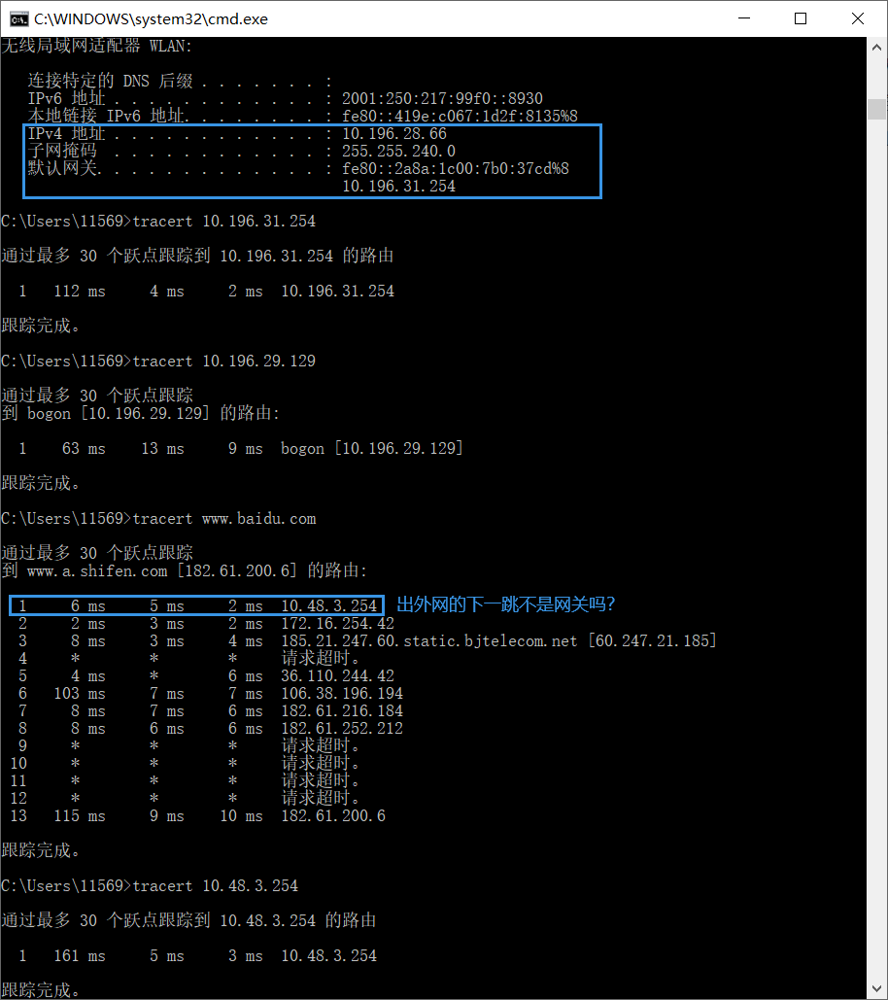
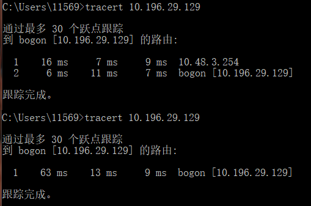

# 【考研向】计算机网络

## GBN、 SR、GDN

---

## 网络层

**路由表和转发表的区别**

- 路由表是网络设备**根据路由协议生成**的表，转发表是网络设备**根据路由表生成**的
  - 路由表更<u>抽象</u>，转发表更<u>具体</u>
  - 路由表存储三元组：网络目标Destination、网络掩码Mask、下一跳NextHop等信息，只描述网络链路状态和方向
  - 转发表必须包含完成转发功能所必需的信息，如主机方面的信息和某些MAC地址信息等，比路由表更<u>详细</u>
    - 因为数据包**到达路由器**的时候，要根据转发表中的“指示”前往特定的**端口**，即转发表类似交换机的地址信息表
    - 即转发表将从路由器的某个输入端口进入的数据包从一个路由器的合适的输入端口转发出去
- [??]转发表的结构应当使查找过程最优化，路由表则需要对网络拓扑变化的计算最优化
- [??]路由表总是由软件实现的，而转发表可由特殊的硬件实现

参考资料
- https://www.cnblogs.com/qinyongzhu/p/4929833.html
- https://blog.csdn.net/qq_43030940/article/details/105037830
- https://www.sohu.com/a/342616410_99906077

---

某天在校园网进行测试，发现用`tracert`的第一跳和默认网关的地址不一样，还不知道是为啥

这难道是路由表更新了的证明

