<!--  -->

## YOLO 学习笔记

### 1.yolo v1

> 论文来源：2016CVPR
> You Only Look Once:Unified,Real-Time Object Detection
> [参考网站](https://pjreddie.com/darknet/yolo/)

#### 1.1 基本思想

(1)将一幅图像分成 $S \times S$ 个网格(grid cell)，如果某个 object 的中心落在网格之中，则这个网格就负责预测这个 object 。

(2)每个网格预测 **B** 个 bounding box ，每个 bouding box 除了要预测位置 `(x,y,w,h)` 外，还要附带一个 `confidence` 值（ yolo 独有， Faster-RCNN 和 SSD 没有），同时还要预测 **C** 个类别的分数。

> eg.Pascal VOC:Our Fianl Prediction is a 7 \* 7 \* 30 tensor.
> S = 7 ( grid cell 为 7 \* 7 )
> B = 2 ( 2 个 bounding box ,每个包含 x , y , w , h , confidence )
> C = 20 ( classes_num = 20 )
> 7 \* 7 \* (2 \* 5 + 10) -> 7 \* 7 \* 30

<!--  -->
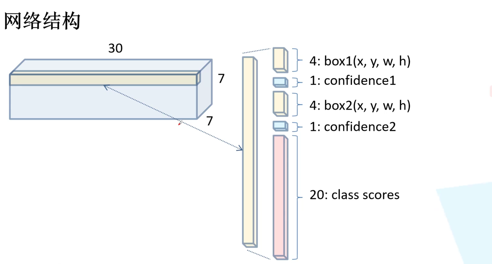

> 每个 bouding box 的坐标是相对值，取值在[0,1]
> x,y : the center of the box **relative to the bounds of the grid cell**
> w,h : the width and height **relative to the whole image**
> confidence : $Pr(Object) \times IOU_{pred}^{truth}$ ,前者为 0 或 1 ，后者为预测框和实际框的交并比

(3)网络结构

 yolov1 的网络结构并不复杂，如下图所示

`其中 s 为步距 stride 的简写，未写的默认为 1 `

<!--  -->
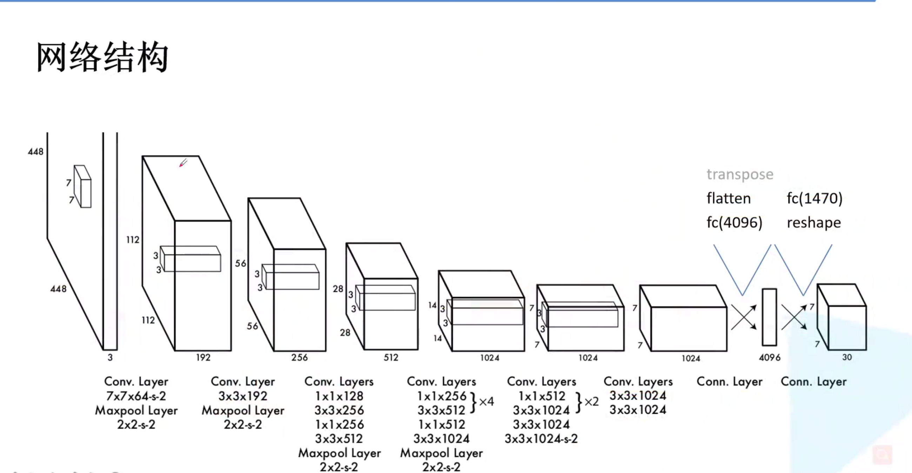

最后两层： 4096 -> 1470 ->( reshape 处理) 7  \* 7 \* 30  （即上述的 cell 结构）

#### 1.2 损失函数

> yolov1 的损失函数由三部分组成,所用方法为误差平方和
> (1) bouding box loss
> (2) confidence loss
> (3) classes loss

==tips:==

(1) bouding box 损失中的宽高损失计算需要**开根号**，目的是**防止不同尺寸的目标框偏移相同距离时的 loss 值一样**（偏移相同的距离，对于大目标而言， IoU 较大，则loss值应该相对较低；对于小目标而言， IoU 较小，则loss值应该相对较高，故采用开根可以起到如此效果）

<!--  -->
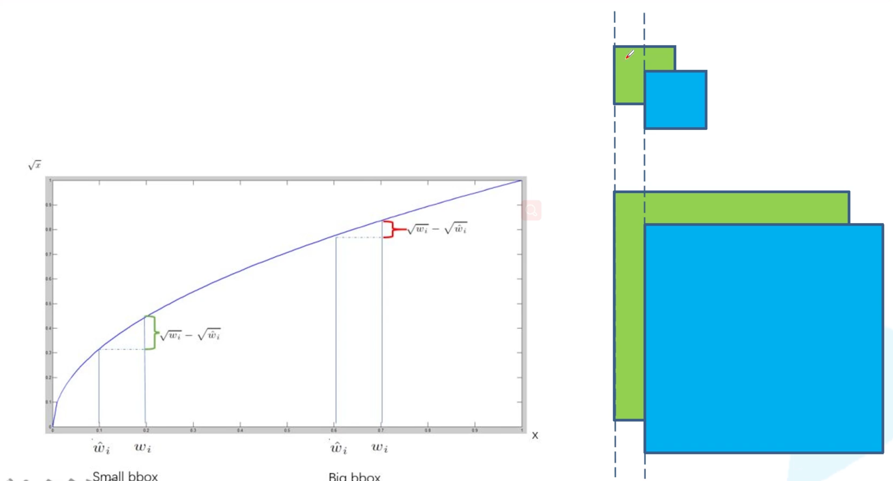

(2) confidence 损失计算中分为正样本和负样本的计算，根据正负样本真实值 $\hat{C_i}$ 取 1 或 0 

#### 1.3 局限性

(1) 群体性目标难预测，例如一群飞鸟，不适合密集性对象

(2) 当目标出现新的尺寸或配置时，预测性能较差

(3) 定位不准确是主要问题（缺少 anchor ）

### 2.yolo v2

> 论文来源：2017CVPR 
> YOLO9000:Better,Faster,Stronger
> [参考网站](http://pjreddie.com/yolo9000/)

#### 2.1 改进

(1) Batch Normalization : 在每个卷积层后都增加了BN层

* 更好收敛
* 减少其他形式的正则化处理
* 可以替代 dropout 操作（防止过拟合）

(2) High Resolution Classifier : 224 * 224 -> 448 * 448

(3) Convolutinal With Anchor Boxes ：小幅度降低了 mAP ，但大幅提升了召回率（查全率）

(4) Dimention Cluster : 基于训练集采用 k-means 聚类的方法得到 anchor(priors) 

(5) Direct Location prediction : 使每个 anchor(prior) 去预测目标中心落在某个 grid cell 区域内的目标(防止加上预测偏移量会导致建议框出现在图片任意一个地方)，网络更易于学习和更加稳定

(6) Fine-Grained Features : 对于小目标的预测，同时融合了高层和低层的特征层，增加了 **passthrough layer** 的处理

(7) Multi-Scale Training ：每迭代 10 个 batch ，就改变输入尺寸的大小，尺寸均为 32 的整数倍，范围在{320,352，……,608}

#### 2.2 网络结构

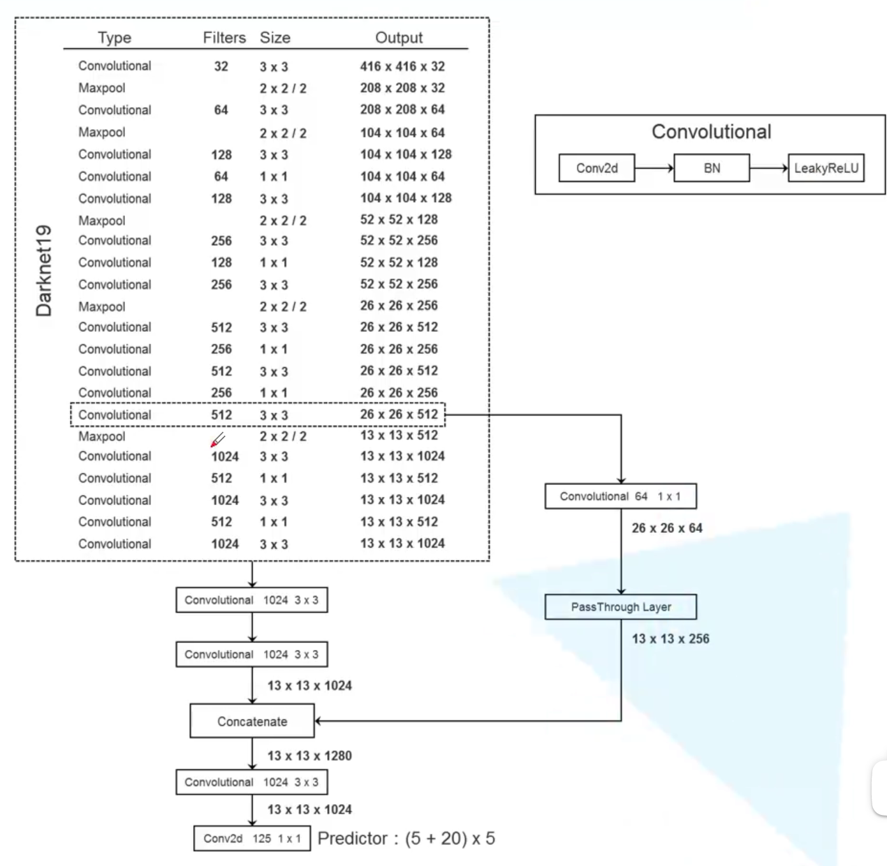

* 图中的每个 convolutional 都是由`卷积层(Conv2D)、 BN 层、激活函数(LeakyReLU)`组成，最后一层只有一个单卷积层作为预测器
*  Size 中未标步距的默认为 1 
*  backbone 中的 Darknet19 (由 19 个卷积层) 移除了最后一层卷积层及其之后的层，后面添加了 3 个 `3 * 3 的 1024 核卷积层`
*  最后预测的 125 个参数即为 5 个 boundingbox ，其中包括 `x , y , w , h , confidence `,以及 `20 个类别`
*  PassThrough Layer 作为高低层的特征层融合途径，其中 26 * 26 * 64 变成 13 * 13 * 256 的原理如下图所示
  
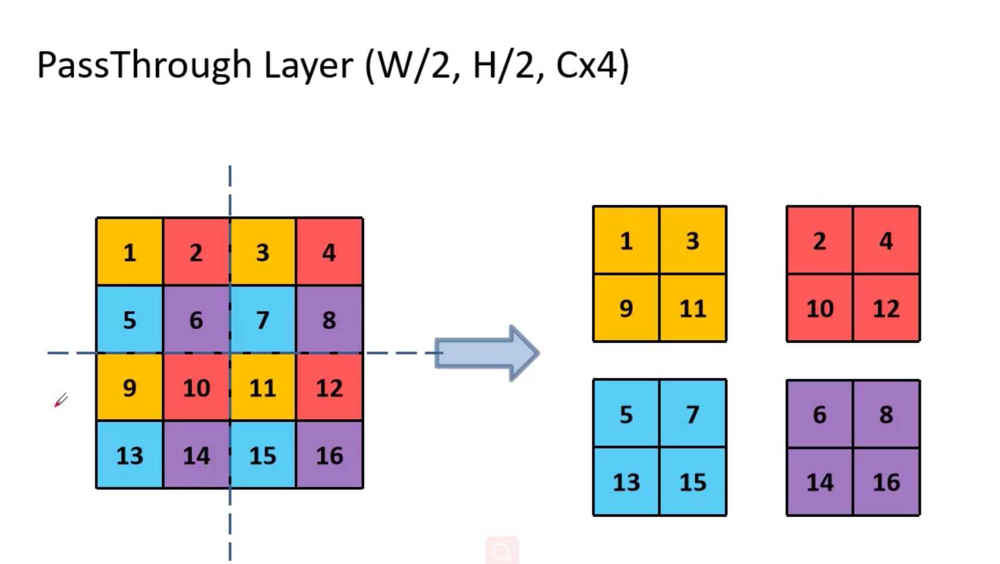

### 3.yolo v3

> 论文来源： 2018CVPR
> [YOLOv3: An Incremental Improvement](https://arxiv.org/pdf/1804.02767.pdf)

#### 3.1  backbone 结构( darknet53 )

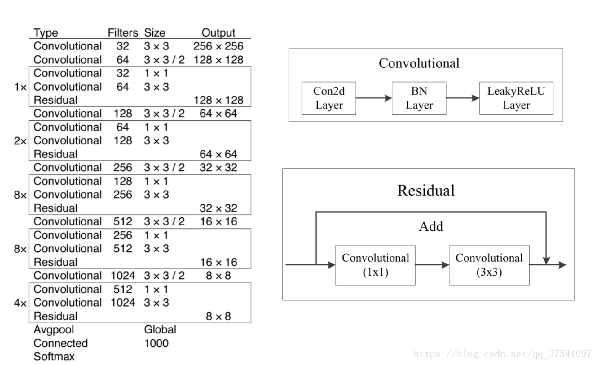

* 53个卷积层（包括最后的 Connnected ），其中 convolutianl 均由`卷积层， BN 层，激活函数(LeakyRelu)`组成，残差结构均为`主分支和捷径分支`的相加结构
* 没有 maxpolling 层，下采样均由卷积层处理( size 为 2 )

#### 3.2 模型结构

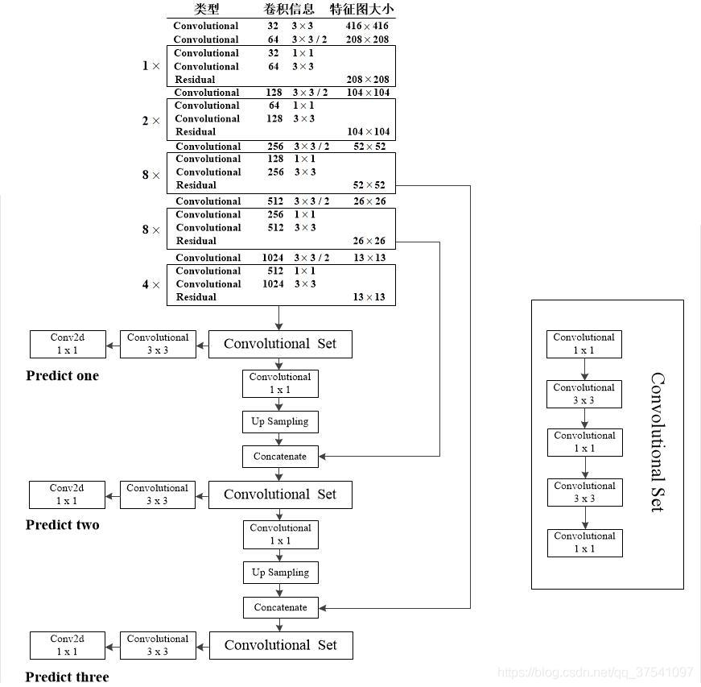

*  yolov3 在 3 个特征层进行预测，每个特征层采用 3 种尺度的 bounding box priors (即 anchor ,同样基于 k-means 聚类),参数如下图所示：
  

每个特征层的预测参数个数为 $N \times N \times [3 * (4 + 1 + 80)]$ ,其中 80 为种类数（ CoCo 数据集）

*  Up Sampling 为上采样层，高和宽会扩大为原来的 2 倍，扩大后便可与原来低层的输出进行 concatenate ，即进行深度上的拼接（ 13 -> 26 -> 52 ）
*  特征图 1 尺寸为 13 * 13,用来预测相对较大的目标；特征图 2 尺寸为 26 * 26,用来预测大小中等的目标；特征图 3 尺寸为 52 * 52，用来预测相对较小的目标

#### 3.3 目标边界框的预测与正负样本匹配

> $\sigma$ 函数即为 sigmoid 函数，将预测的增量限制在一定范围使 anchor 不会超出对应的 grid cell 

与 ground truth 的 重合度最大的 bounding box 定为正样本，重合度不是最大但大于阈值的则忽视（不作为样本，即不计算目标框损失 loss for coordinate prediction 和类别损失 loss for class prediction ,仅计算置信度 objectness ），其余的则为负样本

#### 3.4 损失函数

>  YOLOv3 的损失函数主要分为 3 个部分：目标置信度损失 $L_{conf}(o,c)$ ,目标分类损失 $L_{cla}(O,C)$ 和目标定位偏移量损失 $L_{loc}(l,g)$ , $\lambda_1,\lambda_2,\lambda_3$ 为平衡系数
>  $L(O,o,C,c,l,g) = \lambda_1 L_{conf}(o,c) + \lambda_2 L_{cla}(O,C) + \lambda_3 L_{loc}(l,g)$

##### 3.4.1 目标置信度损失（二值交叉熵）

> $L_{conf}(o,c)=- \frac{\sum_i(o_i ln(\hat{c_i})+(1-o_i) ln(1-\hat{c_i}))}{N}$
> $\hat{c_i}=sigmoid(c_i)$

$o_i \in [0,1]$,表示目标边界与真实边界(ground truth)的 IoU ,c 为预测值， $\hat{c_i}$ 为 c 通过 sigmoid 函数得到的预测置信度， N 为正负样本个数

##### 3.4.2 目标类别损失（二值交叉熵）

> $L_{cla}(O,C) = - \frac{ \sum_{i \in pos} \sum_{j \in cla} (O_{ij} ln(\hat{C_{ij}}) + (1-O_{ij}) ln(1- \hat{C_{ij}}))}{N_{pos}}$
> $\hat{C_{ij}}=sigmoid(C_{ij})$

$O_{ij} \in {\{0,1\}}$，表示目标边界框 i 中是否存在第 j 类目标，$C_{ij}$ 为目标值,$\hat {C_{ij}}$ 为 $C_{ij}$ 通过 sigmoid 函数得到的目标概率， $N_{pos}$ 为正样本个数

##### 3.4.3 目标定位损失

> $L_{loc}(l,g) = \frac{ \sum_{i \in pos} \sum_{m \in \{x,y,w,h\}} (\hat{l_i^m}-\hat{g_i^m})^2}{N_{pos}}$
> $\hat{l_i^x}=Sigmoid(t_x),\hat{l_i^y}=Sigmoid(t_y)$
> $\hat{l_i^w}=t_w,\hat{l_i^h}=t_h$
> $\hat{g_i^x}=g_i^x-c_i^x,\hat{g_i^y}=g_i^y-c_i^y$
> $\hat{g_i^w}=ln(g_i^w/p_i^w),\hat{g_i^h}=ln(g_i^h/p_i^h)$

#### 3.5 yolov3 SPP

> yolov3-SPP-ultralytics 中有许多提升效能的 tricks

##### 3.5.1 Mosaic 图像增强

将若干个原图像进行拼接形成新图像，增强后一张图像的信息就包含原本多张图像的信息，有助于

（1） 增加数据的多样性
（2） 增加目标个数
（3） BN 能一次性统计多张图片的参数

##### 3.5.2 SPP模块

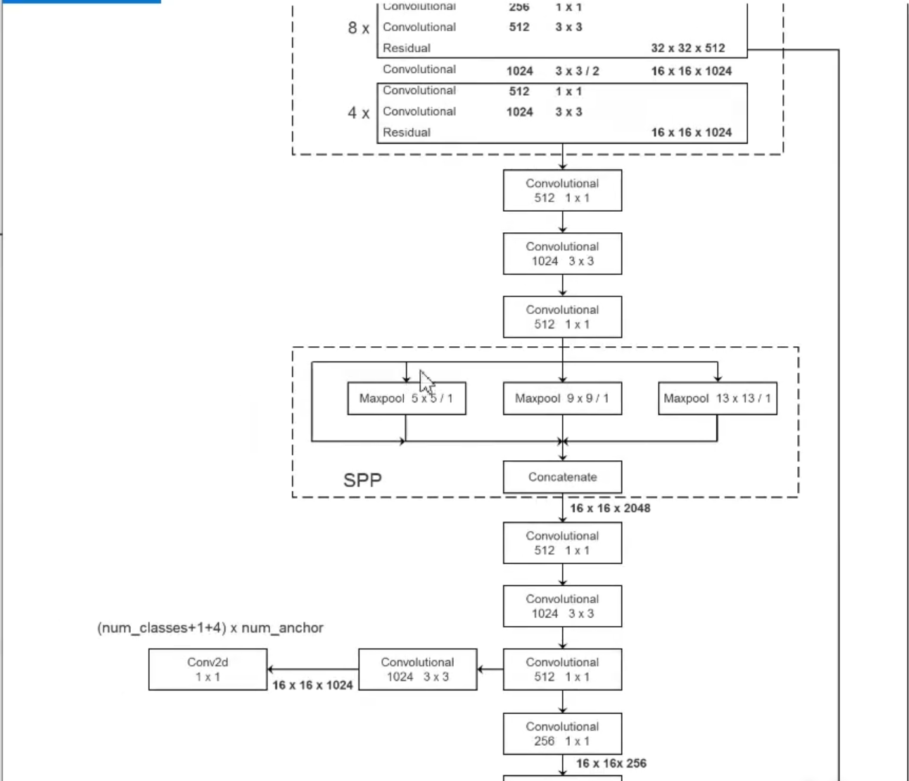

相比于原网络增加了` SPP 模块`（在原网络中的 convolutianal set 插入），包含 3 路最大池化层，将 4 路特征进行 concatenate 拼接(512->2048)

##### 3.5.3 损失函数的进化：CIoU Loss

(1) l2 :原 yolov3 采用的目标定位损失为 l2 损失

> $L_{loc}(l,g) = \frac{ \sum_{i \in pos} \sum_{m \in \{x,y,w,h\}} (\hat{l_i^m}-\hat{g_i^m})^2}{N_{pos}}$
> $\hat{l_i^x}=Sigmoid(t_x),\hat{l_i^y}=Sigmoid(t_y)$
> $\hat{l_i^w}=t_w,\hat{l_i^h}=t_h$
> $\hat{g_i^x}=g_i^x-c_i^x,\hat{g_i^y}=g_i^y-c_i^y$
> $\hat{g_i^w}=ln(g_i^w/p_i^w),\hat{g_i^h}=ln(g_i^h/p_i^h)$

会出现损失相同但 IoU 差距明显的的情况

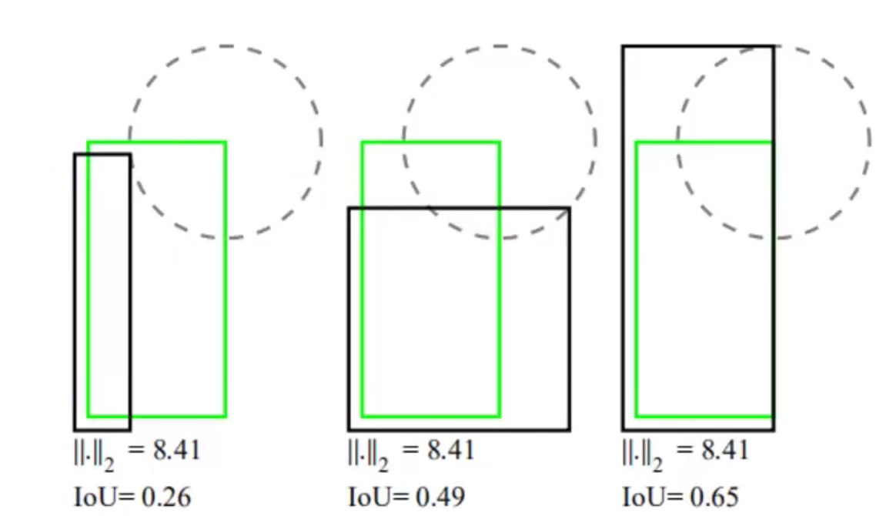

(2) IoU Loss = -ln IoU 或者 IoU Loss = 1 - IoU

能够更好地反应重合程度，具有尺度不变性，但当不相交时 loss 为 0 ，不符合实际情况

(3) GIoU Loss = 1 - GIoU

$GIoU = IoU - \frac{A^c-u}{A^c}$
$-1 \leq GIoU \leq 1$
$0 \leq GIoU Loss \leq 2$

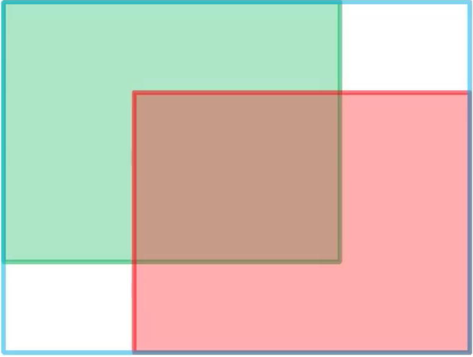

其中，绿色矩形框为 ground truth ,红色矩形框预测框，蓝色矩形框为同时包含它们的最小矩形框， $A^c$ 则为蓝色矩形框面积。`当其重合时， GIoU = 1 ；当其相距无穷远时， GIoU = -1 `

(4) DIoU Loss = 1 - DIoU
$DIoU = IoU -\frac{\rho^2(b,b^{gt})}{c^2} = IoU - \frac{d^2}{c^2}$
$-1 \leq DIoU \leq 1$
$0 \leq DIoU Loss \leq 2$

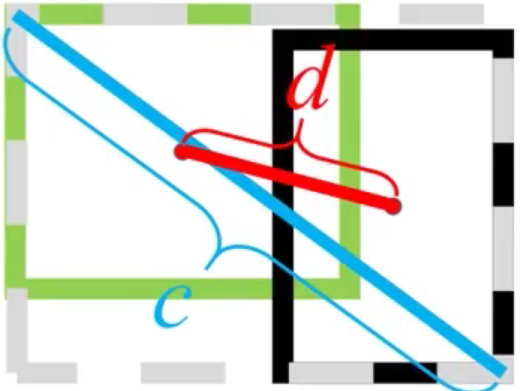

其中，$\rho^2(b,b^{gt})$ 即为预测框和 grounding box 中心点的欧氏距离 d ,  c 则为包含这两个框的最小矩形框的对角线长度。`DIoU损失能够直接最小化两个 boxes 之间的距离，因此收敛速度更快`

(5) CIoU Loss = 1 - CIoU
$CIoU = IoU - (\frac{\rho^2(b,b^{gt})}{c^2}+\alpha \upsilon)$
$\upsilon = \frac{4}{\pi^2}(\arctan \frac{w^{gt}}{h^{gt}}-\arctan \frac{w}{h})^2$
$\alpha = \frac{\upsilon}{(1-IoU)+\upsilon}$

> 一个优秀的回归定位损失应该考虑到 3 种几何参数：
> 重叠面积 中心点距离 长宽比

##### 3.5.4 应对正负样本数量不平衡： Focal Loss

(1) 对于普通的交叉熵损失（二分类）CE (cross entropy) 而言：

$$ CE(p,y)  =\begin{cases}
-ln(p) & y = 1 \\
-ln(1-p) & otherwise \\
\end{cases}$$

或

$$ p_t = \begin{cases}
p & y =1 \\
1 - p & otherwise \\
\end{cases} $$

$CE(p,y)=CE(p_t)=-ln(p_t)$

(2) 引入平衡因子(Balanced Cross Entropy)

$CE(p_t)=-\alpha_t ln(p_t)$

$\alpha$为用于平衡正负样本的超参数

(3) 加入可以区分难易样本的参数

$FL(p_t)=-(1-p_t)^\gamma log(p_t)$

$(1-p_t)^\gamma$ 能够降低易分样本的损失贡献，使得模型专注训练复杂样本

(4) 结合超参数

$FL(p_t) = -\alpha_t(1-p_t)^\gamma ln(p_t)$

即

$$FL(p)=\begin{cases}
-\alpha (1-p)^\gamma ln(p) & y = 1 \\
-(1-\alpha)p^\gamma ln(1-p) & otherwise \\
\end{cases}$$

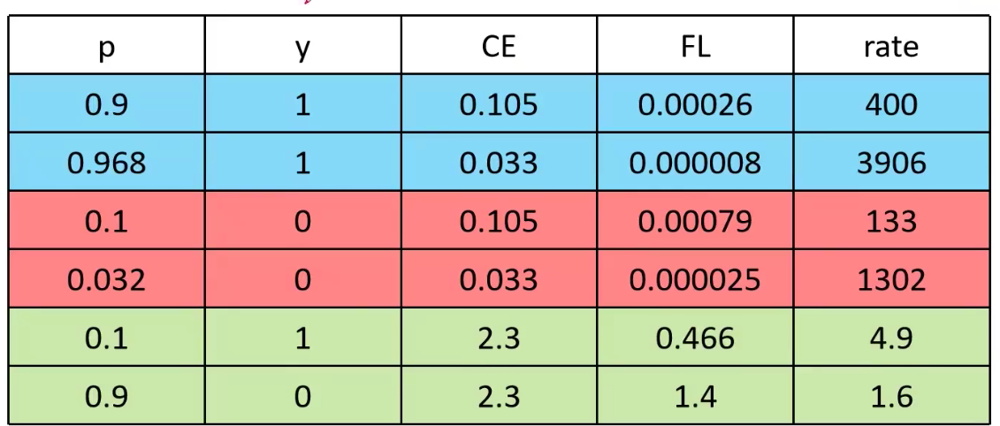

由数据可知，对于简单样本 Focal Loss 相比于 CE 降低了简单样本的损失贡献率，使得模型更好地训练难学习样本

==FocalLoss 易受噪声干扰，在使用过程中需要进行调参，同时也要保证数据集的标注精准度，否则也会使效果下降==

### 4.yolov4

> [Yolov4: Optimal Speed and Accuracy of Object Detection](https://arxiv.org/pdf/2004.10934.pdf)

#### 4.1 网络结构

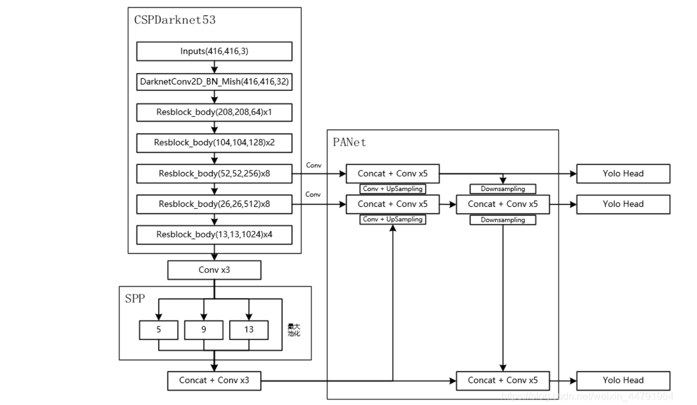

* 基础仍是 yolov3 网络，backbone 为 CSPDarknet53 ，Resblock 为残差结构
* SPP 通过 4 个不同尺度的最大池化对输入的特征层进行池化后拼接，大小分别为 `13 * 13` `9 * 9` `5 * 5` `1 * 1`
* PA Net 与 yolov3 的增强网络类似（特征金字塔结构： FPN + PAN），通过卷积和上采样(FPN:13->26->52)进行对应层的拼接，之后再进行卷积和下采样(PAN：52->26->13)进行对应层拼接`不断上下采样通道堆叠得到更好的特征，对 3 个有效特征层进行特征的反复提取`
* YOLO Head 和 yolov3 的三个预测层相同(N * N * 3 * (5 + 70))

#### 4.2 backbone 网络(CSPDarknet53)

相比于 yolov3 ,其改进的地方有：

(1) 激活函数： LeakyReLU -> Mish

convolutional 结构变为 `darknetConv2D` `BN` `Mish`

Mish 函数： $Mish = x \times tanh(ln(1+e^x))$

其图像为：

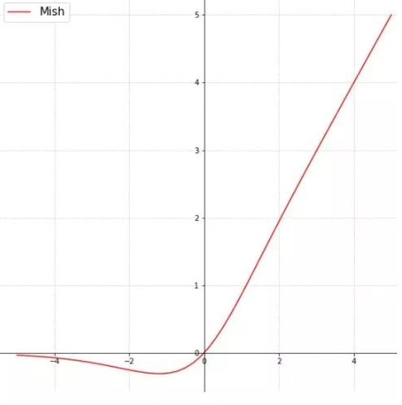

(2) 残差结构使用了 CSPnet 结构

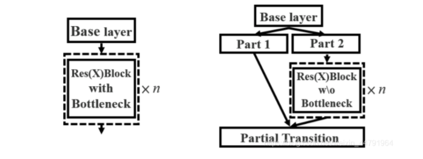

CSP net 将原来残差快的堆叠进行了一个拆分，主干部分不变，另一个部分经过少量处理连接到最后，即多了一条绕过了很多残差结构的大残差边

#### 4.3 tricks

(1) 在预测结构中，yolov4 的方法是：
* 取出每一类得分大于阈值的目标框和得分
* 利用框的位置和得分进行非极大值抑制

(2) Mosaic 数据增强

同 yolov3_SPP 处理，一次对 4 张图片的信息进行组合

(3) Label Smoothing 平滑

`new_onehot_labels = onehot_labels * (1 - label_smoothing) + label_smoothing / num_classes
`

标签(0,1) -> 平滑(0.005,0.995)

(4) 损失函数引入 CIoU ，同 yolov3_SPP

(5) 学习率余弦退火衰减

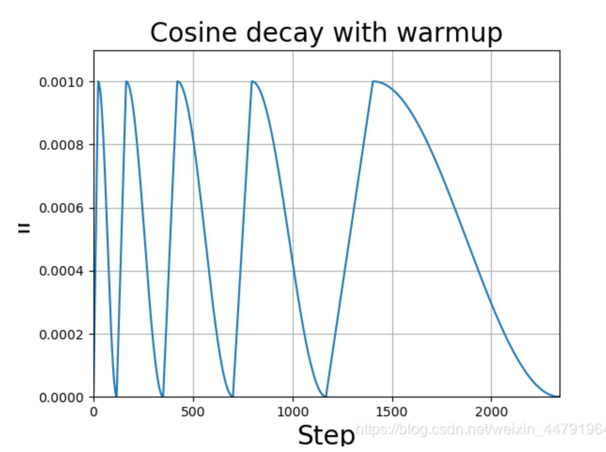

### 5.yolov5

#### 5.1 网络结构

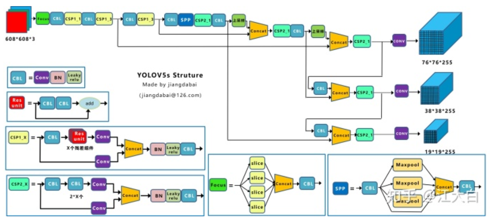

#### 5.2 Focus 结构

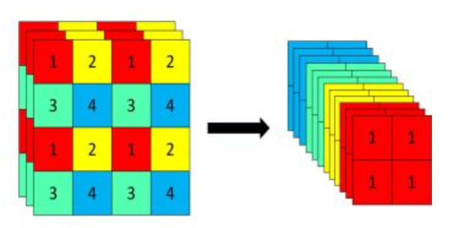

4 * 4 * 3  ->   2 * 2 * 12

#### 5.3 两种 CSP 结构

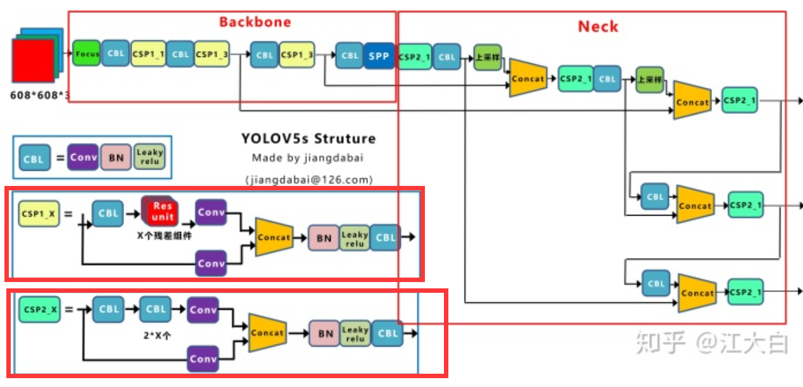

  

